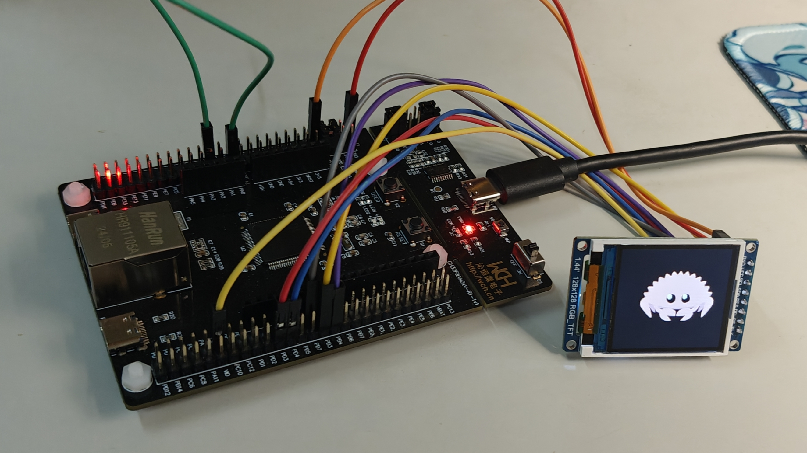

# CH32-ST7735-Demo

Demo for ST7735 under CH32V307VCT6 using ch32-hal

## Features

- SPI: communicate with ST7735, see struct [`DisplayManager`](src/display_manager.rs).

```rust
let cs = p.PD4;
let (sck, sda) = (p.PB3, p.PB5);
let spi = Spi::new_blocking_txonly(p.SPI3, sck, sda, Default::default());
```

- PWM: control screen brightness, see struct [`BacklightManager`](src/backlight_manager.rs).

```rust
let blk = p.PA15;
let pwm = SimplePwm::new(
    p.TIM2,
    Some(PwmPin::new_ch1::<1>(blk)),
    None,
    None,
    None,
    Hertz::khz(1),
    CountingMode::default(),
);
```

## Description

This project is build via [ch32-rs/ch32-hal-template](https://github.com/ch32-rs/ch32-hal-template).

This project is for CH32V307VCT6 only:

| Board        | Display         | Display size |
|:------------:|:---------------:|:------------:|
| CH32V307VCT6 | ST7735 (8 pins) | 144 * 144    |

Driver the ST7735 to display rust logo (from [sajattack/st7735-lcd-rs](https://github.com/sajattack/st7735-lcd-rs)), with a brightness setting button (user button).



## Usage

1. Install [wlink](https://github.com/ch32-rs/wlink) tool.

2. Connect DuPont line.

On board (for <kbd>USER</kbd> button):

`PA14` <---> `KEY`

From ST7735 to board:

| ST7735 | Board |
|:------:|:-----:|
| GND    | GND   |
| VCC    | 3V3   |
| SCL    | PB3   |
| SDA    | PB5   |
| RES    | PB4   |
| DC     | PD3   |
| CS     | PD4   |
| BLK    | PA15  |

3. Customize config at `src/constant.rs` for your ST7735.

4. Run command:

```bash
cargo run --release
# or
make run
```

5. Press <kbd>USER</kbd> to switch brightness.

## Discussion

[Discussions](https://github.com/ch32-rs/ch32-hal/discussions/100) at ch32-hal.

## Special Thanks

- [`ch32-rs/ch32-hal`](https://github.com/ch32-rs/ch32-hal): HAL implementation for CH32V307.
- [`sajattack/st7735-lcd-rs`](https://github.com/sajattack/st7735-lcd-rs): ST7735 driver support.

## License

MIT
